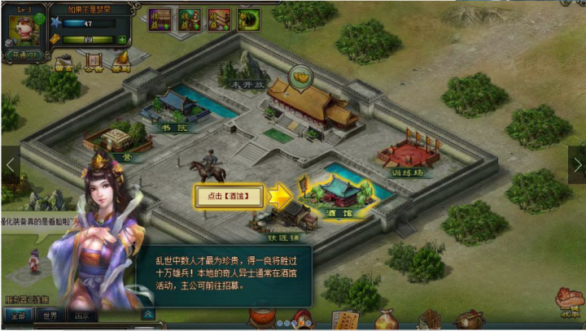
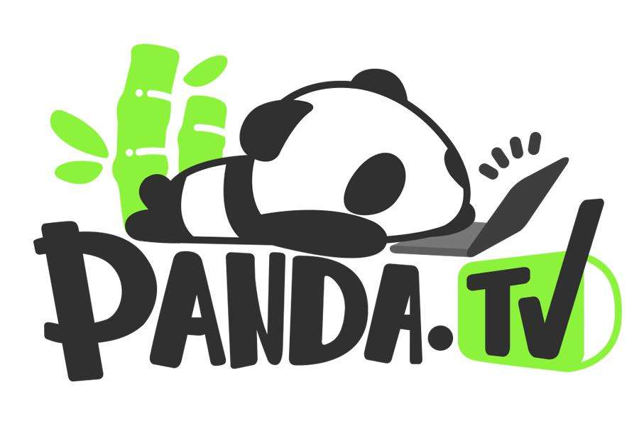
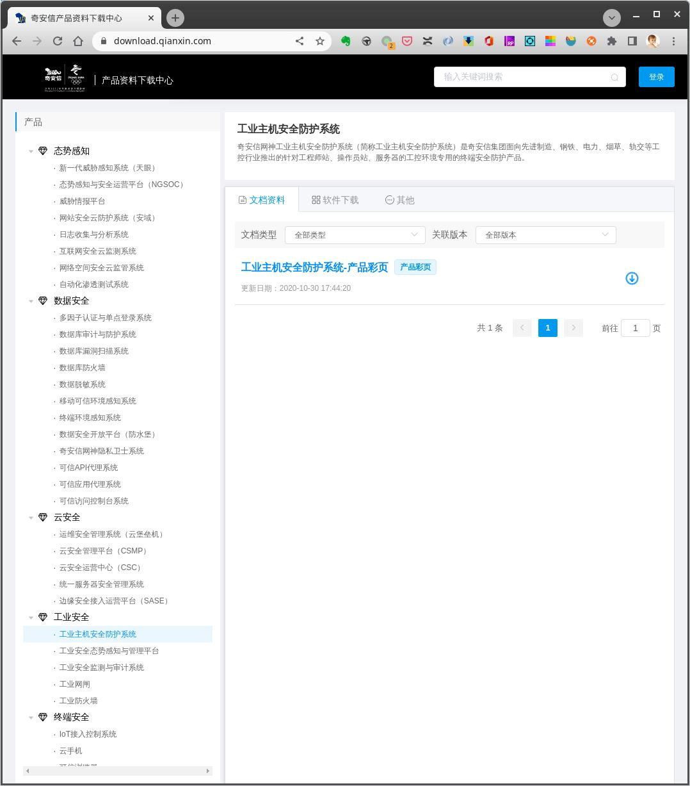
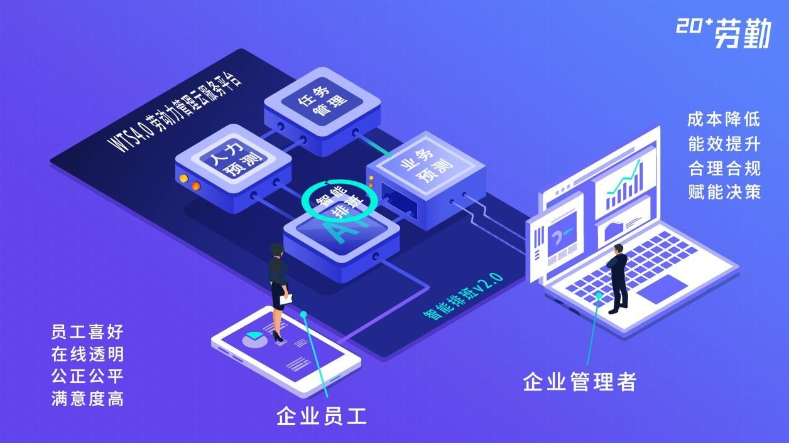
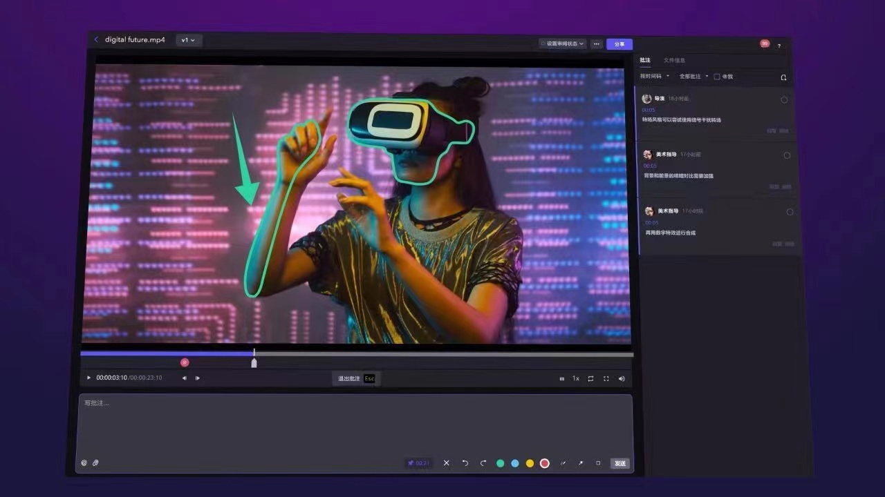

# 历史项目

## 娱乐类

### 游戏

#### Batoo小围棋

* 时间阶段：2008 - 2011
* 团队规模：10 - 20
* 相关技术：Flash / C++ / Delphi
* 公司性质：外资
* 项目状态：已下线

韩方的十一线、十三线小盘围棋游戏的本地化+便携化。客户端重制，二进制通讯协议结构重实现，中国区帐号体系打通。

#### Blackjack页游

* 时间阶段：2009 - 2010
* 团队规模：10 - 20
* 相关技术：Flash / C / Lua
* 项目状态：已下线

真人21点，国标规则，2009年上线康盛uspace，后因法规问题下线。

#### 微三国系列

* 时间阶段：2010 - 2017
* 团队规模：40 - 60
* 相关技术：Flash / PHP / C / Lua
* 项目状态：已出售

微三国1由2010年于新浪内部孵化并独立，初始团队为原Q版新浪微博（已下线）主创人员。微三国2于2013年末迭代。微三国系列接受新浪、微博、万达等投资，保持了8年正向流水，经历了完整的页游起落时期。

#### 三国霸业

* 时间阶段：2013
* 团队规模：10 - 20
* 相关技术：Flash / C / Lua
* 项目状态：未发售

三国霸业为微三国系列的实时版本姊妹篇，2013年开始投产，后由于对接方问题未在平台上线。

#### 坦克战记

* 时间阶段：2015 - 2019
* 团队规模：20 - 30
* 相关技术：H5 / PHP
* 项目状态：已出售

坦克题材的军事游戏，曾在网页、手机、ipad三端同时发布，目前仍有支线（由于版号问题已出售）版本在运营。万达投资。

#### ColorColor

* 时间阶段：2016 - 2017
* 团队规模：10 - 20
* 相关技术：Unity3D / C# / go
* 所属公司：奇虎360
* 项目状态：海外发行

360第一次尝试自研休闲手游，完全从0开始，游戏原型参考paper.io，做了完全的实时化。由于版号及2017年360私有化影响，未在国内发布。国内被翻版为《围城大作战》（非360产品）。

#### 360桌面轻游戏系列

* 时间阶段：2014 - 2017
* 团队规模：20 - 40
* 相关技术：H5 / Flash / Haxe / PHP / C / Lua
* 所属公司：奇虎360
* 项目状态：在线

植入于360安全卫士桌面加速球、360浏览器的轻游戏系列，包括若干版本的酷跑，首创的PVR匹配模式（单机仿对战）。2014至2015年为迭代高峰，后续版本目前依然在运营。

### 社交

#### 新浪博客

* 时间阶段：2004 - 2022
* 团队规模：100 - 200
* 相关技术：标准web前端 / PHP / C
* 所属公司：新浪网
* 项目状态：维护

某段时间中国规模最大、明星效应最强的中文博客平台，首个访问量过亿的个人中文博客（徐静蕾）诞生地。由于博客时代已经过去，目前基本已经处于维护停更状态。

#### 5jia1社团

* 时间阶段：2005 - 2007
* 团队规模：100 - 200
* 相关技术：标准web前端 / PHP
* 公司性质：外资
* 项目状态：已下线

国内第一批web2.0内容网站，早于校内（人人），与MySpace同期。提供了完整的个人内容创作套件。2007年停止迭代。

### 元宇宙

#### 熊猫直播

* 时间阶段：2015 - 2019 / 2021
* 团队规模：500 - 1000 / 100 - 200
* 项目类型：直播 / 元宇宙
* 项目状态：已关停

熊猫TV经历前后两个时代，2015年第一个阶段，为国内Top3的视频直播平台，王思聪牵头、360技术团队内部孵化。熊猫TV 1.0于2019年3月因经营问题关停。
2021年原团队回购熊猫资产，以原品牌重启熊猫TV项目，方向为元宇宙类虚拟形象的直播及互动游戏。迭代至2021年8月，资方撤出，再度停止。

## 通讯

### 实时游戏通讯服务端

* 时间阶段：2008 - 2021
* 团队规模：10 - 20
* 项目状态：持续迭代

曾用于实时游戏、金融、IM、直播弹幕等多个场景的通讯服务，经历前后6个版本的迭代，不同的团队编制及公司，首选开发语言从C过渡到go。最新版本的迭代将在下半年开始，用于支持通用层推送接口。

## 网络安全

### ID5DB身份数据库

* 时间阶段：2012 -
* 团队规模：1 - 10
* 所属公司：国政通

国政通（id5)身份数据的缓存加密落地服务，通过修改memcached，添加基于AES混淆及snappy流加密的数据落地支持。支撑近10亿公民身份证信息的加密存储。

### 奇安信制品分发通道

* 时间阶段：2019 - 2021
* 团队规模：10 - 20
* 所属公司：奇安信
* 项目状态：在线

奇安信集团通用的制品分发平台及对外发布的唯一出口。支持制品（固件、应用、文档等）的安全检查、存储、病毒查杀、黑白名单、关键字过滤、下载加速、固件版本升级路径计算等流程。支撑集团所有的软件类发布业务。

### Fusion平台

* 时间阶段：2020 - 2021
* 团队规模：20 - 30
* 所属公司：奇安信
* 项目状态：在线

奇安信集团内部研发效能平台，对接所有代码级的软件生产流程，自代码提交开始，实现CI/CD工作流、软件自动测试、代码级安全审核、安全漏洞扫描、所依赖开源库的安全版本审核等流程，最终将制品投放到分发通道，实现全程的代码制品不落地，以及可观测，可监管。
当前fusion已经接入集团的总代码资产300亿行，30000+活跃项目以及每天5000次左右的扫描任务。

## 企业服务

### 劳勤云中小企业人力Saas

* 时间阶段：2018 - 2019
* 团队规模：10 - 20
* 所属公司：企新未来
* 项目状态：已出售

最初由一款高端的企业考勤硬件开始，软件部分并入上海劳勤的中小企业云生态计划，支持多种场景（主做非officer的蓝领）的考勤、用工管理、排班、对接薪酬等，提供企业微信小程序。服务已出售。

### 分秒帧

* 时间阶段：2020 - 至今
* 团队规模：100 - 200
* 项目状态：在线

Mediatrack.cn，对音视频生产者（广告、短视频、动漫、创意等）提供审看、生产协作、媒资管理等一系列专业服务，为专业领域的生产效率平台，2022年6月正式商业化。

